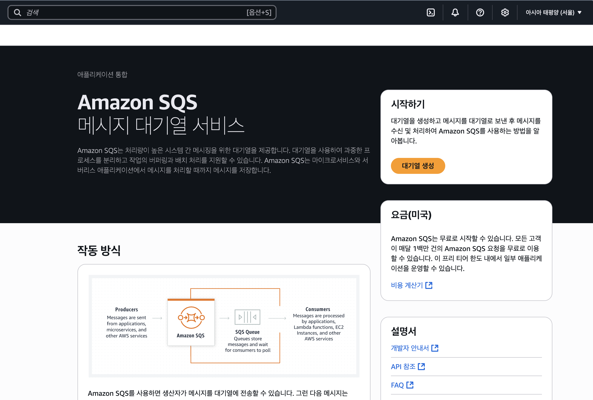
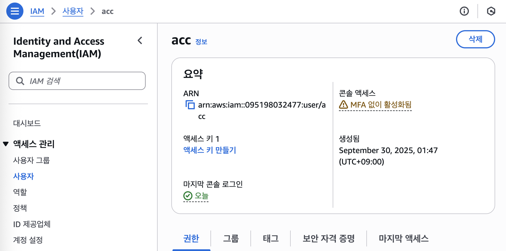
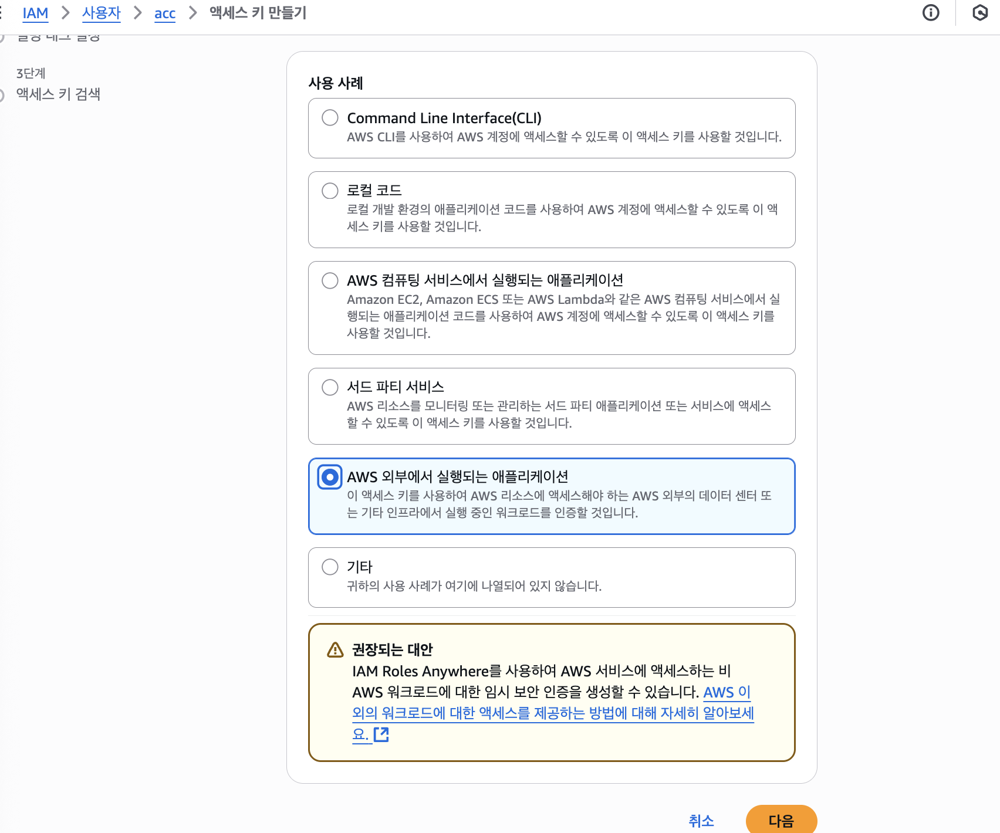
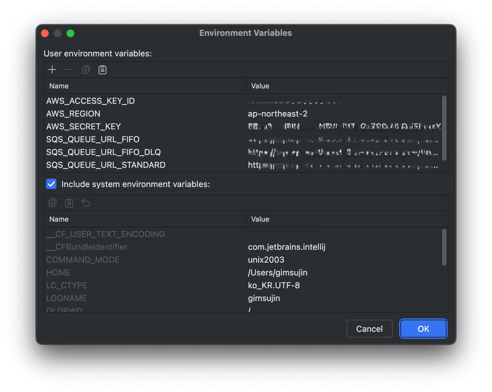

# AWS SQS를 이용한 비동기 메시징 시스템 핸즈온

# 1. AWS SQS

## AWS SQS란?

> **Amazon Simple Queue Service**
>
>
> 완전 관리형 메시지 대기열 서비스로, 분산 시스템 간에 메시지를 안정적으로 전송할 수 있게 해주는 AWS 서비스
>



## 작동 방식

```python
[Producer]  →  [SQS Queue]  →  [Consumer]
 메시지 발행        메시지 저장      메시지 수신 및 처리
```

- **Producer**: SQS 대기열에 메시지 전송
- **Queue**: 메시지를 안전하게 저장
- **Consumer**: 대기열에서 메시지를 폴링하여 처리
- **처리 완료**: 메시지 삭제

### 특징

1. 비동기 통신
    - 시스템 간 느슨한 결합으로 독립적인 확장 가능
    - 장애 격리
2. 대기열 타입 2가지
    - 표준 대기열 (Standard Queue)
        - 거의 무제한 처리량
        - 최소 1회 전달 (At-least-once delivery)
        - 순서 보장 안 됨 (Best-effort ordering)
        - 저렴한 비용
    - FIFO 대기열 (First-In-First-Out Queue)
        - 정확한 순서 보장
        - 정확히 1회 전달 (Exactly-once processing)
        - 초당 300건 (배치: 3,000건)
        - Standard Queue보다 높은 비용

## 사용 사례

1. 마이크로서비스 간 통신

   주문 서비스 → SQS → 결제 서비스 → SQS → 배송 서비스

2. 작업 대기열

   이미지 업로드 → SQS → 이미지 처리 Worker
   비디오 업로드 → SQS → 인코딩 Worker

3. 버퍼링 및 부하 분산

   트래픽 급증 → SQS (버퍼링) → 안정적인 처리

4. 이벤트 기반 아키텍처

   사용자 가입 → SQS → [이메일 발송, CRM 등록, 분석 전송]


# 2. HandsOn Overview

## 실습 시나리오 : 주문 → 배송 시스템

```python
┌─────────────────┐      ┌──────────────┐      ┌──────────────────┐
│  Order Service  │ ───> │  AWS SQS     │ ───> │ Delivery Service │
│   (Producer)    │      │   Queue      │      │   (Consumer)     │
│   Port 8080     │      │              │      │   Port 8081      │
└─────────────────┘      └──────────────┘      └──────────────────┘
                                │
                                ↓ (3번 실패 시)
                         ┌──────────────┐
                         │     DLQ      │
                         │ (Dead Letter │
                         │    Queue)    │
                         └──────────────┘
```

# 3. 핸즈온

## 1. GitHub clone

```python
git clone https://github.com/cowboysj/KHU-ACC-AWS-SQS-Handson.git
cd ACC-SQS
```

### 프로젝트 구조

```python
ACC-SQS/
├── core/                    # 공통 이벤트 모델
│   └── event/
│       ├── OrderEvent.kt
│       └── DeliveryEvent.kt
├── order-service/           # 주문 서비스 (Producer)
│   ├── controller/
│   ├── service/
│   │   └── SqsPublisher.kt
│   └── resources/
│       └── application.yml
└── delivery-service/        # 배송 서비스 (Consumer)
    ├── service/
    │   ├── StandardQueueConsumer.kt
    │   ├── FifoQueueConsumer.kt
    │   └── DlqMonitorService.kt
    └── resources/
        └── application.yml
```

### Producer : SqsPublisher.kt

- Code

    ```kotlin
    @Service
    class SqsPublisher(
        private val sqsClient: SqsClient,
        private val objectMapper: ObjectMapper,
        @Value("\${aws.sqs.queue-url-standard}") private val standardQueueUrl: String,
        @Value("\${aws.sqs.queue-url-fifo}") private val fifoQueueUrl: String
    ) {
        private val logger = LoggerFactory.getLogger(SqsPublisher::class.java)
    
        fun publishOrderEvent(orderEvent: OrderEvent, queueType: String = "standard") {
            // 1️⃣ 대기열 타입에 따라 URL 선택
            val queueUrl = when (queueType.lowercase()) {
                "fifo" -> fifoQueueUrl
                else -> standardQueueUrl
            }
            
            try {
                // 2️⃣ 메시지 본문을 JSON으로 변환
                val messageBody = objectMapper.writeValueAsString(orderEvent)
                
                // 3️⃣ SendMessage 요청 빌더 생성
                val requestBuilder = SendMessageRequest.builder()
                    .queueUrl(queueUrl)
                    .messageBody(messageBody)
                
                // 4️⃣ FIFO 대기열인 경우 필수 파라미터 추가
                if (queueUrl.endsWith(".fifo")) {
                    requestBuilder
                        .messageGroupId(orderEvent.customerId)      // 순서 보장 그룹
                        .messageDeduplicationId(orderEvent.orderId) // 중복 제거 ID
                    
                    logger.info("✅ [FIFO] 주문 메시지 발행 - OrderId: ${orderEvent.orderId}, Group: ${orderEvent.customerId}")
                } else {
                    logger.info("✅ [STANDARD] 주문 메시지 발행 - OrderId: ${orderEvent.orderId}")
                }
    
                // 5️⃣ SQS에 메시지 전송
                val response = sqsClient.sendMessage(requestBuilder.build())
                logger.info("   MessageId: ${response.messageId()}")
            } catch (e: Exception) {
                logger.error("❌ 주문 메시지 발행 실패 - OrderId: ${orderEvent.orderId}", e)
                throw e
            }
        }
    }
    ```


**1️⃣ 대기열 선택 로직**

```kotlin
val queueUrl = when (queueType.lowercase()) {
    "fifo" -> fifoQueueUrl
    else -> standardQueueUrl
}
```

- API 파라미터 `queueType`으로 어떤 대기열을 사용할지 결정
- `?queueType=standard` → 표준 대기열
- `?queueType=fifo` → FIFO 대기열

2️⃣ 객체를 JSON으로 직렬화

```kotlin
val messageBody = objectMapper.writeValueAsString(orderEvent)
```

`OrderEvent` 객체를 JSON 문자열로 변환

```kotlin
{
  "orderId": "abc-123",
  "customerId": "customer-001",
  "items": [...],
  "totalAmount": 150000.0,
  "timestamp": "2025-09-30T14:00:00"
}
```

3️⃣ SendMessage 요청 생성

```kotlin
val requestBuilder = SendMessageRequest.builder()
    .queueUrl(queueUrl)
    .messageBody(messageBody)
```

- AWS SDK의 빌더 패턴 사용
- 어떤 대기열에 보낼지 (`queueUrl`)
- 무슨 내용을 보낼지 (`messageBody`)

4️⃣ FIFO 전용 파라미터

```kotlin
if (queueUrl.endsWith(".fifo")) {
    requestBuilder
        .messageGroupId(orderEvent.customerId)      // 필수
        .messageDeduplicationId(orderEvent.orderId) // 필수
}
```

**`messageGroupId`** 가 필요한 이유

→ 같은 그룹 내에서만 순서 보장하기 위함

고객 A의 주문 1, 2, 3 → groupId = "customer-A" → 순서대로 처리
고객 B의 주문 1, 2, 3 → groupId = "customer-B" → 순서대로 처리

고객 A와 B는 서로 다른 그룹이므로 병렬 처리 가능

`messageDeduplicationId`

→ 5분 이내 같은 ID의 메시지는 중복으로 간주하여 무시함

5️⃣ 전송

```kotlin
val response = sqsClient.sendMessage(requestBuilder.build())
```

- AWS SQS API 호출
- 성공 시 `MessageId` 반환 (예: `f08eb06f-f258-4712-a22e-2e59121b3db8`)

### Consumer : StandardQueueConsumer.kt

- Code

    ```kotlin
    @Service
    class StandardQueueConsumer(
        private val sqsClient: SqsClient,
        private val objectMapper: ObjectMapper,
        private val deliveryService: DeliveryService,
        @Value("\${aws.sqs.queue-url-standard}") private val queueUrl: String
    ) {
        private val logger = LoggerFactory.getLogger(StandardQueueConsumer::class.java)
        private val executorService = Executors.newSingleThreadExecutor()
        @Volatile
        private var isRunning = false
    
        @PostConstruct
        fun startConsuming() {
            if (queueUrl.isEmpty()) {
                logger.warn("⚠️ [STANDARD] Queue URL이 설정되지 않아 Consumer를 시작하지 않습니다.")
                return
            }
            
            isRunning = true
            
            // 1️⃣ 별도 스레드에서 무한 루프 실행
            executorService.submit {
                logger.info("👂 [STANDARD] SQS 메시지 폴링 시작...")
                
                while (isRunning) {
                    try {
                        pollMessages()  // 메시지 폴링
                    } catch (e: Exception) {
                        logger.error("❌ [STANDARD] 메시지 폴링 중 오류 발생", e)
                        Thread.sleep(5000)  // 에러 시 5초 대기
                    }
                }
            }
        }
    
        private fun pollMessages() {
            // 2️⃣ SQS에서 메시지 수신 요청
            val receiveMessageRequest = ReceiveMessageRequest.builder()
                .queueUrl(queueUrl)
                .maxNumberOfMessages(10)    // 한 번에 최대 10개
                .waitTimeSeconds(20)        // Long Polling: 20초 대기
                .build()
    
            val messages = sqsClient.receiveMessage(receiveMessageRequest).messages()
    
            if (messages.isEmpty()) {
                return  // 메시지 없으면 다시 폴링
            }
    
            logger.info("📬 [STANDARD] ${messages.size}개의 메시지 수신")
    
            // 3️⃣ 각 메시지 처리
            messages.forEach { message ->
                try {
                    logger.info("📨 [STANDARD] 메시지 처리 시작 - MessageId: ${message.messageId()}")
                    
                    // JSON을 객체로 역직렬화
                    val orderEvent = objectMapper.readValue(message.body(), OrderEvent::class.java)
                    
                    // 비즈니스 로직 실행
                    deliveryService.processOrder(orderEvent, "STANDARD")
                    
                    // 4️⃣ 성공 시 메시지 삭제 
                    deleteMessage(message.receiptHandle())
                    
                    logger.info("✅ [STANDARD] 메시지 처리 완료 - MessageId: ${message.messageId()}")
                } catch (e: Exception) {
                    logger.error("❌ [STANDARD] 메시지 처리 실패 - MessageId: ${message.messageId()}", e)
                    // 5️⃣ 실패 시 삭제하지 않음 → 자동 재시도
                }
            }
        }
    
        private fun deleteMessage(receiptHandle: String) {
            val deleteRequest = DeleteMessageRequest.builder()
                .queueUrl(queueUrl)
                .receiptHandle(receiptHandle)
                .build()
            
            sqsClient.deleteMessage(deleteRequest)
            logger.debug("🗑️ 메시지 삭제 완료")
        }
    
        @PreDestroy
        fun stopConsuming() {
            logger.info("🛑 [STANDARD] SQS 메시지 폴링 중지 중...")
            isRunning = false
            executorService.shutdown()
            // ...
        }
    }
    ```


**1️⃣ 백그라운드 스레드에서 무한 루프**

```kotlin
executorService.submit {
    while (isRunning) {
        pollMessages()
    }
}
```

SQS는 Push가 아닌 Pull 방식임

2️⃣ Long Polling

```kotlin
.waitTimeSeconds(20)  // 20초 동안 대기
```

```kotlin
Short Polling (waitTimeSeconds = 0):
┌──────────┐                  ┌─────────┐
│ Consumer │ ─── 메시지 있어? ──> │   SQS   │
│          │ <── 없음 ────────── │         │
└──────────┘                  └─────────┘
   0.1초 후 다시 요청 (비효율적!)
   
Long Polling (waitTimeSeconds = 20):
┌──────────┐                  ┌─────────┐
│ Consumer │ ─── 메시지 있어? ──> │   SQS   │
│          │                   │ (20초 대기)
│          │ <── 있음! ────────── │         │
└──────────┘                  └─────────┘
   메시지가 올 때까지 또는 20초까지 대기
```

**Long Polling 장점**

- 빈 응답 횟수 감소 → **비용 절감** (API 호출당 과금)
- 지연 시간 감소 (메시지가 도착하면 즉시 수신)
- CPU 사용률 감소

3️⃣ 배치 처리

```kotlin
.maxNumberOfMessages(10)  // 한 번에 10개
```

- 한 번의 API 호출로 최대 10개까지 수신
- **비용 최적화**: 1개씩 10번 요청 vs 한 번에 10개 요청 = 비용 10배 차이

4️⃣ 성공 시 메시지 삭제

```kotlin
deleteMessage(message.receiptHandle())
```

## 2. AWS Accesskey  설정

### IAM 사용자 생성

1. AWS Console → IAM → 사용자
2. 사용자 추가
3. 권한: `AmazonSQSFullAccess`

### Access Key 생성

1. 사용자 선택 → 보안 자격 증명
2. 액세스 키 만들기
3. **Access Key ID**와 **Secret Access Key** 복사해놓기





## 3. AWS SQS 접속

https://ap-northeast-2.console.aws.amazon.com/sqs/v3/home?region=ap-northeast-2#/homepage

SQS 콘솔 접속 후 리전을 서울로 설정

## 4. SQS 대기열 생성

### 표준 대기열 생성

- 이름: order-queue-standard
- 유형: 표준 (Standard) 선택


나머지 모두 기본값 유지 후 생성하기


### Standard DLQ 생성 → 연결

- 이름: order-queue-standard-dlq
- 유형: 표준 (Standard)
- 메시지 보존 기간: 14일 (원본보다 길게 설정)


- 나머지 설정 기본으로 설정 후 생성

이전에 생성한 원본 `order-queue-standard` 편집 선태 후

아래처럼 생성한 DLQ 넣어주기


**최대 수신 수 동작 원리**

메시지 처리 실패 (1차) → 재시도
메시지 처리 실패 (2차) → 재시도
메시지 처리 실패 (3차) → DLQ로 이동

### FIFO 대기열 생성

- 이름: order-queue.fifo (반드시 .fifo로 끝나야 함!)
- 유형:  FIFO 선택


콘텐츠 기반 중복 제거 활성화 선택 후 생성


### FIFO DLQ 생성 → 연결

- 이름: order-queue-dlq.fifo (반드시 .fifo로 끝나야 함!)
- 유형: FIFO


→ 생성

원본 대기열 편집 → 연결


## 5. 서비스 실행

### 어플리케이션 2개 생성

delivery, order 모듈 설정


### 환경변수 설정

```python
AWS_REGION=ap-northeast-2
AWS_ACCESS_KEY_ID=
AWS_SECRET_KEY=

# 표준 대기열 URL
SQS_QUEUE_URL_STANDARD=

# 표준 DLQ URL 
SQS_QUEUE_URL_STANDARD_DLQ=

# FIFO 대기열 URL
SQS_QUEUE_URL_FIFO=

# FIFO DLQ URL
SQS_QUEUE_URL_FIFO_DLQ=
```


⇒ 두 개의 어플리케이션에서 환경변수 설정



두 서비스 모두 실행

# 4. 테스트

## 테스트 1: 표준 대기열  (순서 비보장)

```python
for i in {1..10}; do
  curl -X POST "http://localhost:8080/api/orders?queueType=standard" \
    -H "Content-Type: application/json" \
    -d "{
      \"customerId\": \"customer-001\",
      \"items\": [{\"productId\": \"p$i\", \"productName\": \"상품$i\", \"quantity\": 1, \"price\": 10000}]
    }"
  echo ""
done

```

Statndard Queue는 순서를 보장하지 않음

```python
📬 [STANDARD] 10개의 메시지 수신

🚚 [STANDARD] 배송 처리 시작 - 상품3 
✅ [STANDARD] 배송 처리 완료

🚚 [STANDARD] 배송 처리 시작 - 상품1
✅ [STANDARD] 배송 처리 완료

🚚 [STANDARD] 배송 처리 시작 - 상품7
✅ [STANDARD] 배송 처리 완료

🚚 [STANDARD] 배송 처리 시작 - 상품2
✅ [STANDARD] 배송 처리 완료

... (순서가 뒤섞여서 처리됨)
```

## 테스트 2 : FIFO 대기열

```python
for i in {1..10}; do
  curl -X POST "http://localhost:8080/api/orders?queueType=fifo" \
    -H "Content-Type: application/json" \
    -d "{
      \"customerId\": \"customer-fifo-001\",
      \"items\": [{\"productId\": \"f$i\", \"productName\": \"FIFO-상품$i\", \"quantity\": 1, \"price\": $((i * 10000))}]
    }"
  echo ""
  echo "---"
done
```

FIFO Queue는 순서를 완벽하게 보장함

```python
📬 [FIFO] 1개의 메시지 수신

🚚 [FIFO] 배송 처리 시작 - FIFO-상품1  ← 순서 보장!
✅ [FIFO] 메시지 처리 완료, 순서 보장됨

📬 [FIFO] 1개의 메시지 수신
🚚 [FIFO] 배송 처리 시작 - FIFO-상품2
✅ [FIFO] 메시지 처리 완료, 순서 보장됨

📬 [FIFO] 1개의 메시지 수신
🚚 [FIFO] 배송 처리 시작 - FIFO-상품3
✅ [FIFO] 메시지 처리 완료, 순서 보장됨

... (반드시 순서대로 처리됨)

📬 [FIFO] 1개의 메시지 수신
🚚 [FIFO] 배송 처리 시작 - FIFO-상품10
✅ [FIFO] 메시지 처리 완료, 순서 보장됨
```

## 테스트 3: DLQ

`DLQ 동작 흐름`

```python
[정상 흐름]
Order → Queue → Consumer → 처리 성공 → 메시지 삭제

[실패 흐름]
Order → Queue → Consumer → 실패 (1차)
           ↓ (가시성 타임아웃 30초)
        재시도 → Consumer → 실패 (2차)
           ↓ (가시성 타임아웃 30초)
        재시도 → Consumer → 실패 (3차)
           ↓
         DLQ 이동 → DlqMonitorService → 알림/로깅
```

```python
curl -X POST "http://localhost:8080/api/orders?queueType=standard" \
  -H "Content-Type: application/json" \
  -d '{
    "customerId": "customer-999",
    "items": [
      {"productId": "p999", "productName": "실패테스트", "quantity": 1, "price": 10000}
    ]
  }'
```

처리 실패 시 자동으로 DLQ로 이동하는지 확인

```python
1차 시도 (즉시):
📬 [STANDARD] 1개의 메시지 수신
📨 [STANDARD] 메시지 처리 시작
❌ [STANDARD] 처리 실패 시뮬레이션 - 시도 횟수: 1
❌ [STANDARD] 메시지 처리 실패

2차 시도 (약 30초 후):
📬 [STANDARD] 1개의 메시지 수신
📨 [STANDARD] 메시지 처리 시작
❌ [STANDARD] 처리 실패 시뮬레이션 - 시도 횟수: 2
❌ [STANDARD] 메시지 처리 실패

3차 시도 (약 60초 후):
📬 [STANDARD] 1개의 메시지 수신
📨 [STANDARD] 메시지 처리 시작
❌ [STANDARD] 처리 실패 시뮬레이션 - 시도 횟수: 3
❌ [STANDARD] 메시지 처리 실패

DLQ로 이동 (약 90초 후):
🚨 [STANDARD DLQ] 1개의 실패 메시지 감지!
   ├─ Order ID: 76ea45f9-fad5-4bb7-8186-6f41b3b75942
   ├─ Customer ID: customer-999
   ├─ Items: [실패테스트]
   └─ Timestamp: 2025-09-30T14:10:38.830774
💡 [STANDARD DLQ] 수동 처리 또는 재처리가 필요합니다.
```